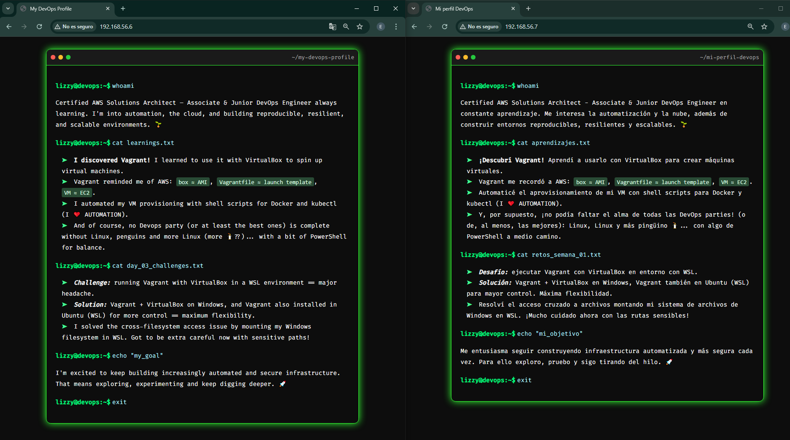

## English Version

- [Haz clic aquí para la versión en Español](docs/README.es.md)

# Hands-On DevOps: Vagrant + Shell Provisioning

> A fully automated local infrastructure setup using Vagrant and shell provisioning. Includes multi-language static sites and Docker tooling for extensibility.
>
> *Created as part of the [90 Días de DevOps con Roxs](https://github.com/roxsross/90daysdevopsbyroxs) challenge.*
> 
> *→ Check out my [technical logbook](https://github.com/DevLizOps/hands-on-devops-90days-logbook) documenting my process throughout the challenge.*

> [!NOTE]
> This project is not officially affiliated with Roxs or the original program. It solely reflects my own knowledge and learning process.

## 📦 About this project

This project demonstrates how to provision a virtual machine (VM) using **Vagrant** with **shell scripts**, applying key DevOps concepts like reproducibility, automation, and Infrastructure as Code (IaC).

Upon launching, the VM is configured with:

- ✅ **Nginx**, serving a simple static website (available in English or Spanish).
- ✅ **Docker**, pre-installed and ready to run containers.
- ✅ **kubectl**, included as groundwork for future Kubernetes experimentation.

All setup is performed through **shell scripts**, reinforcing reproducibility and demonstrating Infrastructure as Code (IaC) principles in a minimal, yet extendable environment.

Each environment (`vm-en/`, `vm-es/`) is isolated and configurable, showing how to scale environments through modular provisioning.

## 🛠️ Why Vagrant?

**Vagrant** simplifies the creation and configuration of development environments by automating VM setup with reproducible code. In this project:

- The `Vagrantfile` defines the infrastructure of the VM (OS, networking, synced folders, provisioning through shell scripts).

- **Shell scripts** act as provisioning tools that ensure the VM reaches a desired state.

> The use of shell scripts allows full control over package installation and system configuration without relying on external configuration managers.

## 🧰 Requirements

Before starting, make sure you have the following installed on your machine:

- [VirtualBox](https://www.virtualbox.org/) – hypervisor for the virtual machines.
- [Vagrant](https://developer.hashicorp.com/vagrant) – infrastructure management tool.

> ⚠️ **Using WSL2?** Be aware that VirtualBox does **not work well inside WSL2**, and Vagrant can’t reliably manage VMs from that environment.
>
> After several failed attempts to integrate them (cross-installations, aliases, plugins…), I opted for a more robust setup:
>
> 👉 All virtualization (Vagrant + VirtualBox) is handled directly from **Windows**, while I use my Linux environment (WSL2) for development and file editing.
>
> 🔗 [Read the full analysis in my Logbook](https://github.com/DevLizOps/hands-on-devops-90days-logbook)

## 📁 Project structure

```
hands-on-devops-vagrant-shell-provisioning/
├── vm-en/
│   ├── Vagrantfile
│   ├── static_website/
│   │   ├── index.html
│   │   └── styles.css
│   └── scripts/
│       ├── install_docker.sh
│       └── install_nginx.sh
├── vm-es/
│   ├── Vagrantfile
│   ├── static_website/
│   │   ├── index.html
│   │   └── styles.css
│   └── scripts/
│       ├── install_docker.sh
│       └── install_nginx.sh
```

## 🔍 Key Components

Each folder (`vm-en` and `vm-es`) contains a fully isolated VM definition and provisioning logic, allowing the same base infrastructure to serve content in different languages:

- `Vagrantfile`:
  Defines VM settings (box, network, provisioning logic). Each folder (vm-en/, vm-es/) contains its own VM definition.

- **Provisioning Scripts**:
  - `install_nginx.sh`: installs Nginx and deploys the static site to /var/www/html/.
  - `install_docker.sh`: installs Docker and kubectl, laying the groundwork for future containerized workloads.

- **Static Website**
  - A basic multilingual site to validate the provisioning and web server setup. A placeholder to expand DevOps storytelling or monitoring dashboards.
  - This separation of concerns ensures that each script is focused, traceable and easy to modify or extend.

## 🌐 Network configuration

The VM uses a **private network** with a fixed IP address:

```ruby
config.vm.network "private_network", ip: "192.168.56.6"
```

This ensures predictable access from the host machine without interfering with DHCP (Dynamic Host Configuration Protocol).

You can access the served static website via http://192.168.56.6 once the VM is running.

## 🚀 Getting started

### 1. **Clone the repository**

```bash
git clone https://github.com/DevLizOps/hands-on-devops-vagrant-shell-provisioning.git
cd hands-on-devops-vagrant-shell-provisioning/vm-en
```

### 2. **Launch the virtual machine**

read -rp "Nombre del archivo a guardar en ~/.ssh (ej: vagrant_key): " DEST_NAME
```bash
vagrant up
```

This will:

- Download the Ubuntu 22.04 base image (if not cached).
- Start the VM.
- Copy the static website files into the VM.
- Execute the provisioning scripts automatically.

### 3. **Open the website**

Go to: http://192.168.56.6.

> This IP is configured as a private network in the `Vagrantfile`.



### 4. **Access the virtual machine**

If you want to explore the virtual machine or run manual commands, you can SSH into it:

```bash
vagrant ssh
```

Use this to verify installed tools, inspect logs, or continue experimenting inside the VM.

## 🧪 Validation Steps

Inside the VM:

- Run `nginx --version` to verify web server installation.

- Run `docker --version` and `kubectl version --client` to confirm CLI tools are installed.

- Check `/var/www/html` to see deployed site content.

## 🧹 Shutting down and cleaning up

Once you're done testing the project, you can stop and remove the virtual machine:

```bash
vagrant halt    # Gracefully stops the VM
vagrant destroy # Delete the VM and deletes all resources
```

This helps free up disk space and keeps your system clean.

## 🧤 Hands-On Highlights

- Setting up reproducible environments with Vagrant.
- Provisioning infrastructure using shell scripts.
- Configuring web servers and preparing systems for container use.
- Organizing bilingual infrastructure setups in a modular structure.
- Debugging provisioning processes and managing VM lifecycles.

## 📄 License

This project is licensed under the [MIT License](LICENSE).  
Use, adapt, and share it freely with proper attribution.

> 🌱  Feel free to personalize the static website or build additional services into this VM to showcase your DevOps learning journey.
